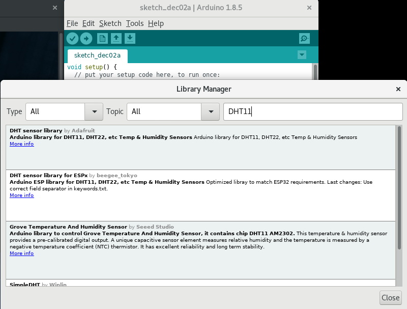

# Getting started with Arduino

**Screenshot of the Serial Monitor.**

Installation of Arduino:
`sudo dnf install arduino && reboot`

Then run `arduino` on the terminal

**NodeMCU Board option**

In Tools, you can see the option written on `Board`

**All the required libraries**

DHT11 Sensor library

Now lets interface an LED and change the brightness of the LED printing it on the Serial Monitor and indicating the analog Values.

* Connect your board to you computer and then (in my case I am using pin 9 for the output) power it on pin 9.
* Connect a LED(Light Emitting Diode) to your circuit and then upload & execute the script.
* Open the Serial Monitor and type the value you want to give as input to change the brightness of the LED according to the input.

**My Circuit**

At 70,

At 250,

**My Serial Monitor**

1st, 70 is pressed and then 180 is pressed, so we get value `70 and 180 + 70 = 250`

